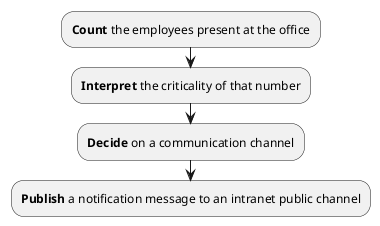

import CanvasBanner from "/src/components/canvas-banner.jsx";

<CanvasBanner marginTop="10px">

## Mission Statement

</CanvasBanner>

During the global Covid19 pandemic the austrian government decreed that, depending on the size of the building, only a certain amount of people are allowed to stay indoors (`n` employees/m²). In essence that meant that at peak times, only 30 people are allowed to be present at any time of day.

The presence bot's primary goals were to:

<CanvasBanner>

## System Context

</CanvasBanner>

| **Actor**         | **Description**                                                                                                                                                                                                                      |
| ----------------- | ------------------------------------------------------------------------------------------------------------------------------------------------------------------------------------------------------------------------------------ |
| **Access System** | Keeps track of all employees entering the office.                                                                                                                                                                                    |
| **Presence Bot**  | Monitors the employee count provided by the _Access System_, interprets the criticality of that number, decides on a communication channel and sends notifications                                                                   |
| **MS Teams**      | The main hub for communication at the office and therefore most obvious choice of notification channel available to all employees. Employees get real time updates and push notifications. Simple and uncomplicated contact tracing. |
| **User**          | Subscribe to a communication channel and consume real time updates                                                                                                                                                                   |

<CanvasBanner>

## Technical Context

</CanvasBanner>

| **Actor**          | **Description**                                                                                                                                                                                                                                                                                                        |
| ------------------ | ---------------------------------------------------------------------------------------------------------------------------------------------------------------------------------------------------------------------------------------------------------------------------------------------------------------------- |
| **Access System**  | Keeps track of all employees entering the office.                                                                                                                                                                                                                                                                      |
| **Access API**     | Provides an access point to the access system.                                                                                                                                                                                                                                                                         |
| **Presence Bot**   | Periodically polls the current employee count and triggers a power automate flow with the current employee count.                                                                                                                                                                                                      |
| **Messaging API**  | Facade that hides technical details needed to trigger a power automate flow.                                                                                                                                                                                                                                           |
| **Power Automate** | Bridge that allows us to communicate with company resources in an authenticated manner without breaking company regulations. Interprets the criticality, and builds a formatted message to be sent to the companies communication hub (MS Teams). Periodically pushes a teams messages for simplified contact tracing. |
| **Presence Twin**  | Virtual counter part and digital twin to a Presence Cube. Through the twin users and machines can interact with physical devices                                                                                                                                                                                       |
| **Presence UI**    | User interface capable of visualizing and interacting with the Presence Twin. This UI enables users to directly look up current presence information as well as directly look up current presence information. without having to accquire an expensive / time consuming physical device                                |
| **Presence Cube**  | Physical device that displays presence infos and notifications on-site.                                                                                                                                                                                                                                                |

<CanvasBanner>

## Services

</CanvasBanner>

- [Presence Cube]
- [Presence Twin]
- [Presence UI]

[presence twin]: ./presence-twin
[presence cube]: /docs/presence-cube
[presence ui]: /docs/presence-ui
