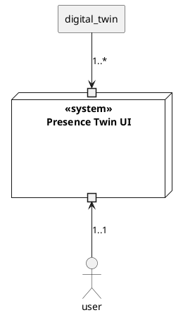

import CanvasBanner from '/src/components/canvas-banner.jsx'


<CanvasBanner marginTop="10px">

## Mission Statement
</CanvasBanner>

A _Digital Twin_ service provides APIs for accessing and interacting with _presence devices_. A _presence device_ can have multiple forms:

- **Physical:** A _physical device_ is capable of displaying _presence information_ and notifications (see [Presence Cube] for details).
- **Virtual:** _Virtual devices_ represent physical devices. Therefore they follow the same mission statement but rely on digital technologies only.

The Presence UI provides a frontend to visualize and interact with these device capabilities. With such a user interface in place, we can ensure the [Presence Bot]s ability to communicate with users without requiring them to own/build a physical device.

[presence bot]: /
[presence twin]: ./presence-twin/
[presence cube]: ./presence-cube/

<CanvasBanner>

## Functional Context
</CanvasBanner>

| Actor             | Description                                                     |
| ----------------- | --------------------------------------------------------------- |
| **User**          | Views device information and interacts with device capabilities |
| **Presence Twin** | Represents the state and capabilities of a physical device      |



<CanvasBanner>

## Boundary conditions
</CanvasBanner>

| Condition                 | Description                                                                                                                                                                                                          |
| ------------------------- | -------------------------------------------------------------------------------------------------------------------------------------------------------------------------------------------------------------------- |
| Multiplatform Development | Development shall be made possible regardless of the operating system                                                                                                                                                |
| Multiplatform Usage       | The software is usable on all common devices (desktop, web and mobile)                                                                                                                                               |
| Low time budget           | The application has to be usable within a handful of weeks (1. October 2022)                                                                                                                                         |
| Softwareinfrastructure    | Deployment will be done in a containerized form. The finished image is then integrated into the existing Presence Bot docker-compose environment.                                                                    |
| Hardwareinfrastructure    | The prime goal is to be able to deploy a functional application on a Raspberry Pi                                                                                                                                    |
| Libraries and Frameworks  | Since the deadline is quite intense, it is best to rely on tools the team is already familiar with including: `Angular`, `Mobx`, `RXJS`, `Nx`, `npm`, `typescript`, `scss`, `docker`, `docker-compose`, `powershell` |
| Design Patterns           | Domain Driven Design, SOLID, Quality-Driven Software Architecture, Modulith                                                                                                                                          |

<CanvasBanner>

## Top Quality Goals
</CanvasBanner>

- **Accessibility**\
  The app is easily accessable and useable on day-to-day devices / platforms.
  - As a software developer, I can get productive within 15 minutes.
  - As a sysadmin, I can deploy a new version of a system in 15 minutes.
  - As a sysadmin, I can integrate the system into an existing environment with configuration effort only.
  - As a user, I can understand the installation and configuration process and be able to use it within minutes.
  - As a user, when switching back and forth between web, desktop and mobile versions of the system, I get the same experience without drastic changes in UX.
- **Maintainability**\
  The application shall be well extendable and maintainable by maintaining good software practices and metrics driven pillars of confidence.
  - As a developer, given a complete infrastructure breakdown, development on the domain can go on almost unhindered.
  - As a developer, when having to modify the domain, I can lean on a set of test suits to give me the confidence to quickly make adjustments. Currently, [confidence is defined](https://stackoverflow.com/a/90021/1177024) as 70%-80% test coverage.
  - As a developer, when checking in new code, automated tests ensure my code is functioning as expected and is free of build errors.
  - As a developer, when checking in new code, automatic code metrics help me see regressions in code quality (quality metrics now < quality metrics before).
  - As a developer, having to implement new requirements, I can modify existing code without breaking unrelated areas.
- **Reliability**\
  Since people will rely heavily on the accuracy of the presented visualizations, special care shall be put into its stability, resiliency and correctness of values.
  - As a user, in case of an infrastructure failure, the application stays accessible.
  - As a user, when errors occur, I will not be affected / required to reboot or restart.
  - As a user, given state changes, I will be able to determine their accuracy. For instance, changes in criticality values could be tagged with it's latest update timestamp to prevent making decisions on out-of-date data.


<CanvasBanner>

## Informal Diagram
</CanvasBanner>

```diff
- replace with a hand drawn graphic
```

```plantuml

node "<<system>>\nPresence Twin UI" {
  port "User" as port_user
  port "Digital Twin n" as port_digital_twin

  card infrastructure
  card "application core" as application_core
  card view
  card subscriber

  subscriber -up- infrastructure
  subscriber -le- application_core
  port_user -up- view
  view -up- application_core
  infrastructure -up- port_digital_twin
  application_core -right- infrastructure
}
```

<CanvasBanner>

## Accepted Compromises
</CanvasBanner> 

- **release speed over accessability**\
  Due to the intense time budget, it is better to be less **accessibile** at first.
  - We can assume that version 1 is used exclusively by engineers, maintained and deployed by the core team. We still provide the full functionality and quality to all target devices, but the user facing visuals will be in pilot quality only.
  - Iterations beyond 1.0 can focus on UX and technical maintainability concerns.
